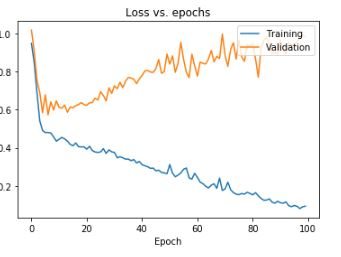
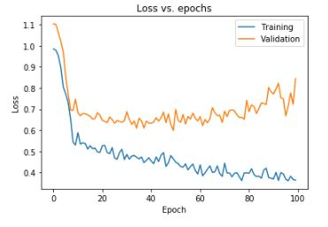
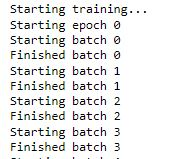
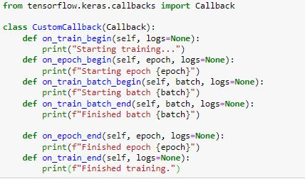

# Project Description
- In this project i regularized a model using L2 regularization with dropout while also comparing the perfomance improvements visually by plotting loss during training and validation.
- Due to reduced overfitting, the validation loss is decreased after using L2 regularization and dropout relative to the 
unregularized model.

    - Before Regularization

        - 
    - After Regularization

        - 

- I also implemented custom callbacks for running code when certain events occur like begining of training, batches and epochs.

    - Callbacks running

        - 
    
    - Callbacks code

        - 

# Libraries Used
 - Tensorflow Keras
 - Matplotlib
 - Sklearn

## Contact
 - LinkedIn: [Natan Asrat](https://linkedin.com/in/natan-asrat)
 - Gmail: nathanyilmaasrat@gmail.com
 - Telegram: [Natan Asrat](https://t.me/fail_your_way_to_success)
 - Youtube: [Natville](https://www.youtube.com/@natvilletutor)